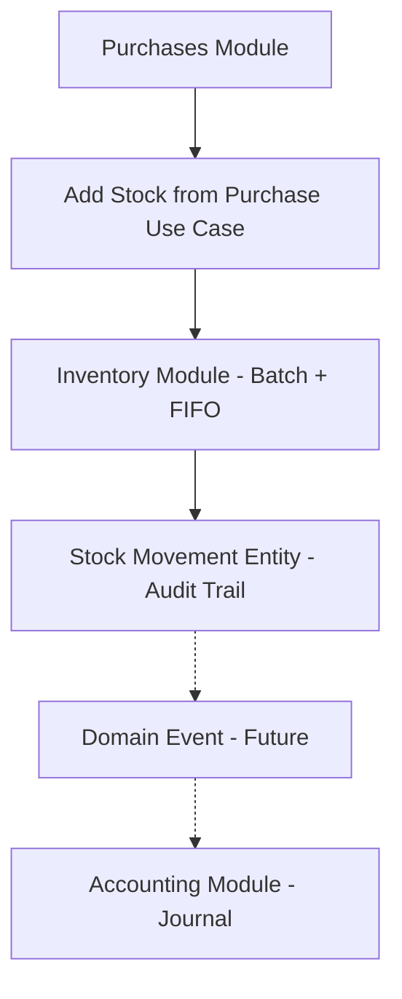

# Transaction Flow Contract
*(Modular Clean Architecture)*

## 🎯 Objective
* To maintain **stable boundaries** between modules.
* To prevent **circular dependencies**.
* To ensure that future **accounting integration** does not require changes to the inventory core.

---

## 🔄 Global Flow Overview
The main business flow of the system is as follows:

1. **Purchase** → Inventory (Stock In)
2. **Sale** → Inventory (FIFO Out)
3. **Inventory Adjustment** → Accounting
4. **Transactions** → Journal Entries

### Logical Flow Diagram:


---

## 🤝 Module Responsibility Contract

### 1. Products Module (Catalog Core)
**Handles:**
* Product
* Variant
* Category
* Brand
* Device (if still a catalog)

**Is not allowed to:**
* Store stock.
* Access inventory.

**External Usage:**
* Inventory can only use **Product Reference**.

### 2. Inventory Module (Stock Core)
**Handles:**
* Batch
* FIFO deduction
* Stock mutation
* Stock opname

**Main Entities:**
* Product Reference
* Product Batch Entity
* Stock Movement Entity

**Is not allowed to:**
* Import Product Entity.
* Import Sales Entity.
* Import Purchase Entity.

### 3. Purchases Module (Stock Producer)
*Purchases generate stock.*

**Mandatory Flow:**
`Create Purchase` → `Add Stock from Purchase Use Case (Inventory)`

**Is not allowed to:**
* Insert directly into the batch table.
* Calculate FIFO.

### 4. Sales Module (Stock Consumer)
*Sales reduce stock.*

**Mandatory Flow:**
`Create Sales Transaction` → `Deduct Stock FIFO Use Case (Inventory)`

**Is not allowed to:**
* Access batch repository.
* Calculate FIFO (FIFO can only be done in the inventory).

### 5. Accounting Module (Financial Core)
* **Is not allowed** to read the inventory table directly.
* **Only accepts**:
    * Transaction Result
    * OR Domain Event (future)

**Examples:**
* Stock Added from Purchase
* Stock Deducted from Sale
* Stock Adjusted from Opname

---

## 📄 Stock Movement Contract (IMPORTANT)
This entity serves as a bridge between inventory and accounting.

**File:** `inventory/domain/stock-movement.entity.ts`

**Structure:**
* `id`
* `product ID`
* `variant ID`
* `batch ID`
* `movement type`
* `quantity`
* `reference type`
* `reference ID`
* `created at`

> [!IMPORTANT]
> All stock changes **MUST** result in a **Stock Movement Entity**. This will avoid major refactoring when accounting is activated.

---

## 📡 Domain Event Contract (Design Only)
*(Not Yet Implemented)*

**Events:**
* Stock Added from Purchase
* Stock Deducted from Sale
* Stock Adjusted from Opname

**Minimum Payload:**
* `product ID`
* `variant ID`
* `quantity`
* `reference ID`
* `timestamp`

---

## 🚦 Dependency Flow (Must be Stable)
**Global dependency direction:**
`products` → `inventory` → `purchases / sales` → `accounting`

**Prohibited:**
* `inventory` imports `purchases`
* `inventory` imports `sales`
* `accounting` imports `inventory repository`

---

## 📎 Reference Type Contract (Anti-Coupling Rule)
All cross-module entities must use:
* **Product Reference**
* **Customer Reference**
* **Supplier Reference**

**Example:**
```typescript
type ProductReference = {
  productId: string
  variantId?: string
}
```

---

## ✅ Implementation Safety Checklist
*(Before the transaction module is activated)*

- [ ] Inventory does not import product entities.
- [ ] Sales do not access batch repository.
- [ ] Purchases do not insert batch directly.
- [ ] Stock Movement has been created.
- [ ] Product Reference is being used.
