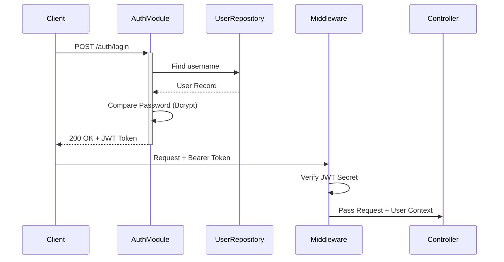

# Authentication & Security

## Overview
Authentication is handled via JWT (JSON Web Tokens) with a stateless architecture.
- **Access Token**: Short-lived (1 hour), sent in `Authorization: Bearer <token>` header.
- **Refresh Token**: Not implemented (Simple JWT flow for now).

## Workflow

## Security Rules

1.  **Passwords**: MUST be hashed using `Bun.password.hash` (Bcrypt).
2.  **Environment Variables**: Secrets (JWT_SECRET, DB_URL) must be in `.env`.
3.  **Validation**: All inputs validated with Zod in Controllers.
4.  **Role Based Access (RBAC)**:
    - `admin`: All Access
    - `teknisi`: Service Module (Read/Write), Inventory (Read)
    - `kasir`: Sales Module (Write), Inventory (Read), Service (Read)

## Implementation Details

### Module Structure (`modules/auth`)
- `auth.controller.ts`: Login/Register endpoints.
- `auth.service.ts`: Password hashing, Token generation.
- `auth.repository.ts`: User lookup.

### Middleware (`middlewares/auth.middleware.ts`)
Intersects requests, validates headers, and populates `c.get('user')`.
