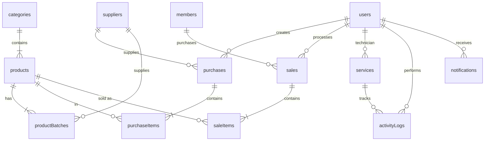

# Database Schema Documentation

## Overview
- **Type**: SQLite
- **File Location**: `apps/backend/data/store.db` (Previously root `sqlite.db`)
- **ORM**: Drizzle ORM
- **Migration Tool**: Drizzle Kit

## Relations Diagram (ERD)

## Tables

### Users (`users`)
| Column | Type | Notes |
|---|---|---|
| id | TEXT (PK) | UUID (`USR-001`) |
| username | TEXT | Unique |
| password | TEXT | Bylcrypt Hash |
| role | TEXT | `admin`, `teknisi`, `kasir` |
| name | TEXT | Full name |
| image | TEXT | Optional Avatar URL |

### Members (`members`)
| Column | Type | Notes |
|---|---|---|
| id | TEXT (PK) | Member ID (`MBR-XXX`) |
| name | TEXT | Member Name |
| phone | TEXT | Unique Phone Number |
| email | TEXT | Email (Optional) |
| discountPercent | INT | Default Discount (0-100) |
| points | INT | Loyalty Points |
| image | TEXT | Profile Photo |

### Suppliers (`suppliers`)
| Column | Type | Notes |
|---|---|---|
| id | TEXT (PK) | UUID (`SUP-001`) |
| name | TEXT | Supplier Name |
| image | TEXT | Supplier logo (optional) |
| brands | JSON | List of brands (Optional) |

### Products (`products`)
| Column | Type | Notes |
|---|---|---|
| id | TEXT (PK) | UUID (`PRD-001`) |
| code | TEXT | Universal SKU/Barcode |
| name | TEXT | Product Name |
| categoryId | TEXT (FK) | Link to `categories` |
| stock | INT | Total Aggregated Stock |
| minStock | INT | Alert Level |
| image | TEXT | Product Image |

### Product Batches (`product_batches`)
**Critical Concept**: Actual stock is held here. `products.stock` is just a sum.
| Column | Type | Notes |
|---|---|---|
| id | TEXT (PK) | Batch ID (`B-XXX`) |
| productId | TEXT (FK) | Link to Product |
| supplierId| TEXT (FK) | Link to Supplier |
| buyPrice | INT | COGS (HPP) |
| sellPrice | INT | MSRP |
| currentStock| INT | Remaining Stock |
| initialStock| INT | Stock at Entry |
| variant | TEXT | Free text variant (Original, OEM) |

### Sales (`sales`)
 Header for POS transactions.
| Column | Type | Notes |
|---|---|---|
| id | TEXT (PK) | `SAL-TIMESTAMP` |
| totalAmount | INT | Gross Total |
| finalAmount | INT | Net Total (after discount) |
| paymentMethod| TEXT | Cash, Qris, Transfer |
| userId | TEXT (FK) | Cashier |

### Services (`services`)
Repair tickets.
| Column | Type | Notes |
|---|---|---|
| id | INT (PK) | Auto Increment |
| no | TEXT | `SRV-YYYYMMDD-XXX` |
| status | TEXT | `antrian`, `dikerjakan`, `selesai` |
| technicianId| TEXT (FK) | Assigned Tech |
| device | JSON | Device info |
| diagnosis | JSON | Tech notes |

### Notifications (`notifications`)
System alerts.
| Column | Type | Notes |
|---|---|---|
| id | INT (PK) | Auto Increment |
| userId | TEXT (FK) | Recipient |
| type | TEXT | `low_stock`, `service` |
| isRead | BOOLEAN | Read status |
