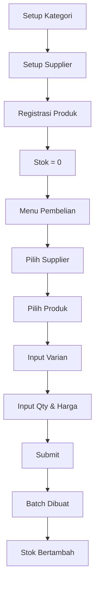
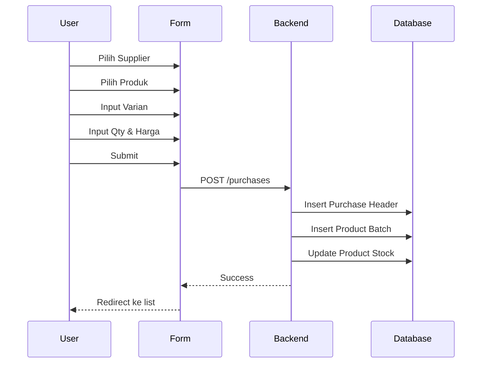
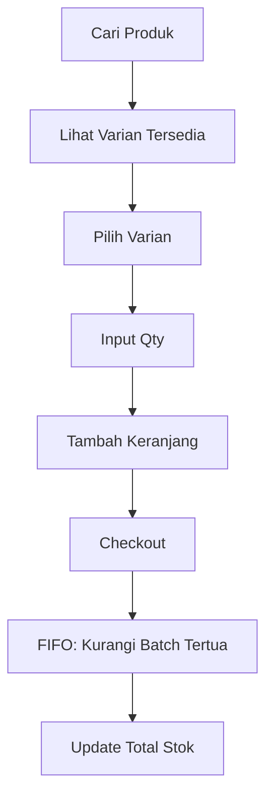

# Inventory Flow

## Overview

Modul Inventory menangani manajemen produk, stok masuk (pembelian), dan stok keluar (penjualan) dengan sistem FIFO.

---

## Konsep Utama

### 1. Produk vs Batch
- **Produk**: Template barang (nama, kategori, SKU)
- **Batch**: Unit stok aktual dengan harga dan varian

```
Produk: LCD Samsung A54
├── Batch #1: Original (PT. Global), Stok: 5, Beli: 300k
├── Batch #2: OEM (PT. Global), Stok: 3, Beli: 200k
└── Batch #3: Copy (Toko ITC), Stok: 10, Beli: 100k
```

### 2. Varian
Varian adalah **teks bebas** yang menunjukkan tipe/kualitas barang:
- Original
- OEM
- Copy
- KW Super
- dll.

Varian **dibuat saat pembelian**, tidak perlu setup terpisah.

### 3. FIFO (First In First Out)
Stok yang masuk duluan akan keluar duluan:
```
Batch masuk:
1. 10 unit @ 100k (Jan)
2. 5 unit @ 120k (Feb)

Jual 12 unit:
- 10 unit dari Batch #1 @ 100k
- 2 unit dari Batch #2 @ 120k
```

---

## Alur Input Produk



### Langkah Detail

#### 1. Setup Kategori
```
Menu: Products → Tab Kategori
Buat: LCD, Baterai, Aksesoris, dll.
```

#### 2. Setup Supplier
```
Menu: Products → Tab Supplier
Buat: PT. GlobalParts, Toko ITC, dll.
```

#### 3. Registrasi Produk
```
Menu: Products → Tab Produk → Tambah
Input:
- Nama: LCD Samsung A54
- Kode: LCD-SA54 (atau auto-generate)
- Kategori: Sparepart
- Min Stock: 5

Hasil: Produk dibuat dengan Stok = 0
```

#### 4. Input Stok via Pembelian
```
Menu: Pembelian → Buat Baru
1. Pilih Supplier: PT. GlobalParts
2. Tambah Item:
   - Produk: LCD Samsung A54
   - Varian: Original (ketik bebas)
   - Qty: 10
   - Harga Beli: 300,000
   - Harga Jual: 450,000
3. Submit

Hasil:
- Batch baru dibuat (B-XXX)
- Stok produk bertambah 10
```

---

## Alur Pembelian (Stock In)



### API Request
```json
{
  "supplierId": "SUP-001",
  "items": [
    {
      "productId": "PRD-001",
      "variant": "Original",
      "qty": 10,
      "buyPrice": 300000,
      "sellPrice": 450000
    }
  ]
}
```

### Database Changes
1. **purchases**: Insert header PO
2. **product_batches**: Insert batch baru
3. **products**: Update total stock

---

## Alur Penjualan (Stock Out)



### FIFO Logic
```typescript
// Pseudo-code
async function reduceStock(productId, qty) {
  // Ambil batch dari yang tertua
  const batches = await db.query.productBatches
    .findMany({
      where: eq(productBatches.productId, productId),
      orderBy: [asc(productBatches.createdAt)]
    });
  
  let remaining = qty;
  for (const batch of batches) {
    if (remaining <= 0) break;
    
    const reduce = Math.min(batch.currentStock, remaining);
    batch.currentStock -= reduce;
    remaining -= reduce;
    
    await db.update(productBatches)
      .set({ currentStock: batch.currentStock })
      .where(eq(productBatches.id, batch.id));
  }
  
  // Update total stock
  await updateProductStock(productId);
}
```

---

## Refund ke Supplier

### Alur
```
Pilih Supplier
    ↓
Lihat Batch dari Supplier tersebut
    ↓
Pilih Batch yang akan di-refund
    ↓
Input Qty Refund
    ↓
Submit
    ↓
Stok Batch Berkurang
```

### Use Case
- Barang cacat dari supplier
- Barang tidak sesuai pesanan
- Negosiasi retur

---

## Stok Opname (Manual Adjustment)

### Use Case
- Barang hilang
- Barang rusak
- Koreksi kesalahan input

### Alur
```
Menu: Products → Detail Produk
    ↓
Pilih Batch
    ↓
Adjust Stock
    ↓
Input alasan
    ↓
Log ke Activity
```

---

## Reporting

### Stok Rendah
```sql
SELECT * FROM products WHERE stock < min_stock;
```

### Nilai Inventori
```sql
SELECT 
  SUM(current_stock * buy_price) as total_value
FROM product_batches
WHERE current_stock > 0;
```

### Produk per Supplier
```sql
SELECT 
  supplier_id,
  supplier_name,
  COUNT(*) as batch_count,
  SUM(current_stock) as total_stock
FROM product_batches
GROUP BY supplier_id;
```

---

## Best Practices

1. **Selalu input stok via Pembelian** - Agar HPP tercatat
2. **Jangan edit stok manual** - Kecuali untuk opname
3. **Gunakan varian yang konsisten** - Original, OEM, Copy
4. **Cek stok rendah rutin** - Set min_stock yang tepat
5. **Review batch lama** - Hindari stok menumpuk
