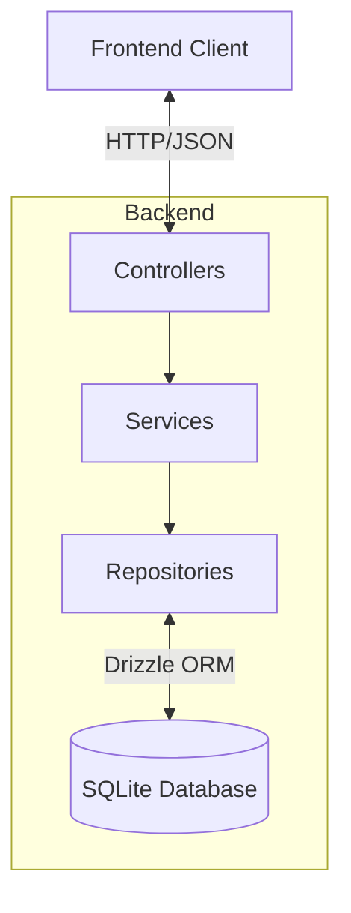

# System Overview

## Purpose
Simplify Inventory & Document App is a modern web application designed for streamlined inventory management (products, suppliers, batches) and service tracking (repair tickets). It focuses on simplicity, accuracy through FIFO, and excellent user experience.

## Architecture
This project follows a Monorepo structure managed by Turborepo, separating concerns into distinct applications and shared packages.

### Backend Architecture
**Layered & Feature-based Architecture:**
- **Framework**: Hono.js (Lightweight & Fast)
- **Database**: SQLite with Drizzle ORM
- **Pattern**: Controller-Service-Repository (CSR)
- **Organization**: Feature-based modules (e.g., `modules/inventory`, `modules/auth`)

### Frontend Architecture
- **Framework**: SvelteKit 5 (Modern & Reactive)
- **UI Library**: shadcn-svelte (Tailwind CSS)
- **Pattern**: Component-based UI with centralized API helpers
- **State**: Svelte Runes ($state, $effect)

## Key Features
1.  **Inventory Management**:
    - Multi-supplier support
    - Free-text variants (Original, OEM, etc.)
    - FIFO Batch tracking for accurate COGS
    - Universal SKU support
2.  **Service Tracking**:
    - End-to-end repair workflow (Queue -> Done)
    - Technician assignment & detailed audit logs
    - WhatsApp integration for updates
3.  **Point of Sales (POS)**:
    - Integrated with inventory batches
    - Automated stock deduction
4.  **Reporting**:
    - Real-time stock value
    - Low stock alerts

## Technology Stack
- **Runtime**: Bun
- **Language**: TypeScript
- **Package Manager**: Bun (Workspace)
- **Build Tool**: Turbo
