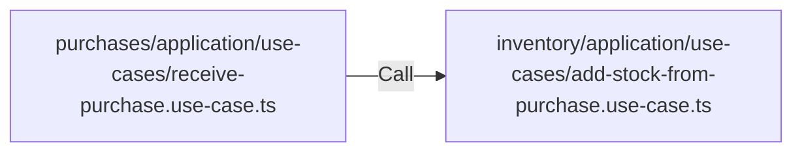

# Purchases → Inventory Contract
*(Batch + Cost + FIFO Ready)*

## Purpose
This contract governs how the **purchases** module interacts with the **inventory** module to:
* Manage **stock additions** based on batches.
* Store **purchase prices** (cost layers).
* Enable **FIFO deduction** by the sales module.
* Ensure **domain structure consistency** across modules.

---

## Core Principles
* **Inventory** is the *source of truth* for stock.
* **Purchases** must not directly write to batch or stock tables.

### Dependency Direction
* `purchases` → `inventory` (allowed via use-case)
* `inventory` → `purchases` (not allowed)
* `purchases` → `products` (allowed)
* `inventory` → `products` (allowed via ProductRef only)

### Main Rule:
**Purchases must not import:**
* `batch repository`
* `stock entity`
* `inventory infrastructure`

**Purchases can only call:**
* Inventory Application Layer (Use Case / Facade)

---

## Integration Pattern
Use **Application Service Call**:



> [!CAUTION]
> **Prohibited:** `purchases` → `inventory repository` 

---

## Data Contract (Input)
Purchases must send the following structure to inventory:

```typescript
export interface AddStockFromPurchaseInput {
  productId: string
  variantId?: string
  supplierId: string
  invoiceNumber: string
  purchaseDate: Date
  quantity: number
  unitCost: number
  totalCost: number
  batchNumber?: string
  expiredAt?: Date
  createdBy: string
}
```

### Field Explanation
| Field | Purpose |
| :--- | :--- |
| `productId` | Product reference |
| `supplierId` | For cost tracing |
| `quantity` | Incoming stock |
| `unitCost` | FIFO layer cost |
| `batchNumber` | Optional external batch |
| `expiredAt` | Optional |
| `createdBy` | Audit log |

---

## Inventory Responsibilities
After receiving the contract, inventory must:

### 1. Create Batch Layer
Inventory creates a `StockBatchEntity` containing:
* `productRef`
* `supplierId`
* `remainingQty`
* `unitCost`
* `batchId` (internal UUID)

### 2. Record Stock Movement
Inventory must record a `StockMovementEntity` with **type = PURCHASE** for audit history.

### 3. FIFO Ready Layer
Inventory must ensure `remainingQty > 0` so it can be used by `sales/deduct-stock-fifo.use-case`.

### 4. Activity Logging
The inventory use case must call `IActivityLogger` with the event: **STOCK_PURCHASED**.

---

## Output Contract (Return)
Inventory returns:

```typescript
export interface AddStockFromPurchaseResult {
  batchIdsCreated: string[]
  totalQuantityApplied: number
  success: boolean
}
```

**Used by purchases for:**
* **Validation**: Purchases MUST verify that `totalQuantityApplied === request.quantity`.
* **Idempotency**: Linking future returns or reversals.

---

## Validation & Integrity Rules
Inventory **must** perform validation:
* `quantity > 0`
* `unitCost > 0`
* **Product** and **Variant** exists via Product Module.
* **Supplier** exists.

**Transaction Integrity**:
* If `success` is false or quantity mismatch, the entire transaction MUST be rolled back.
* Partial applies are not allowed in the production flow.

---

## What Purchases MUST NOT Do
* **Must not** calculate FIFO.
* **Must not** write to stock tables.
* **Must not** create batch entities.
* **Must not** reduce stock.
* *Purchases only record purchase transactions.*

---

## Future Extension (Recommended)
For accounting system readiness, add the following fields:
* `journalRef?: string`
* `currency?: string`
* `exchangeRate?: number`

---

## Folder Reference
```text
modules/
 ├─ purchases/
 │   └─ application/
 │        └─ use-cases/
 │             receive-purchase.use-case.ts
 ├─ inventory/
 │   └─ application/
 │        └─ use-cases/
 │             add-stock-from-purchase.use-case.ts
```

---

## Clean Architecture Rule
* **Inventory** is: **Stock Owner**
* **Purchases** is: **Stock Producer**
* **Sales** is: **Stock Consumer**