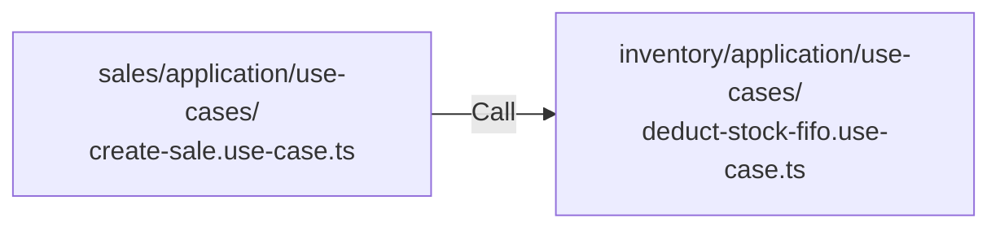

# Sales → Inventory Contract
*(FIFO Deduction + COGS Ready)*

## 🎯 Purpose
Kontrak ini mengatur bagaimana module **sales**:
* **Mengurangi stok** menggunakan FIFO.
* **Menghasilkan Cost of Goods Sold (COGS)** bagi akuntansi.
* **Menjaga konsistensi** batch layer.
* **Menghindari manipulasi stok** langsung.

---

## 🏗️ Core Principles
* **Inventory** tetap menjadi *single source of truth* untuk stok.

### 🚥 Dependency Direction
* `sales` → `inventory` (allowed via use-case only)
* `inventory` → `sales` (not allowed)
* `sales` → `products` (allowed)
* `inventory` → `products` (allowed via ProductRef only)
* `sales` → `accounting` (allowed via journal contract)

### 🚫 Rule Utama:
**Sales tidak boleh:**
* Import `batch repository`.
* Import `stock entity`.
* Import `inventory infrastructure`.

---

## 🔄 Integration Pattern
Sales harus memanggil **Inventory Application Layer**:



> [!CAUTION]
> **Dilarang:** `sales` → `inventory repository` ❌

---

## 📄 Data Contract (Input)
Sales mengirim data item transaksi ke inventory:

```typescript
export interface DeductStockFifoInput {
  productId: string
  variantId?: string
  quantity: number
  salesInvoice: string
  salesDate: Date
  warehouseId?: string
  createdBy: string
}
```

### Field Explanation
| Field | Purpose |
| :--- | :--- |
| `productId` | Referensi produk |
| `quantity` | Jumlah yang dijual |
| `salesInvoice` | Audit trace |
| `salesDate` | Timestamp movement |
| `createdBy` | Audit log |

---

## 🛠️ Inventory Responsibilities
Setelah menerima request FIFO deduction, inventory wajib:

### 1. FIFO Batch Deduction
Inventory harus:
* Mengambil batch berdasarkan urutan: **Oldest Batch First**.
* Mengurangi `remainingQty` pada batch terkait.
* Jika stok tidak cukup, wajib: `throw OutOfStockError`.

### 2. Generate Cost Layers (COGS Source)
Inventory harus menghasilkan breakdown cost per layer:

```typescript
export interface FifoCostLayer {
  batchId: string
  quantity: number
  unitCost: number
  totalCost: number
}
```

**Contoh:**
| Batch | Qty | Cost |
| :--- | :--- | :--- |
| B1 | 2 | 10.000 |
| B2 | 1 | 11.000 |
*Hasil ini akan digunakan oleh module accounting.*

### 3. Record Stock Movement
Inventory harus mencatat `StockMovementEntity` dengan **type = SALE**.

### 4. Activity Logging
Use case wajib memanggil `IActivityLogger` dengan event: **STOCK_DEDUCTED_FIFO**.

---

## 📤 Output Contract (Return)
Inventory mengembalikan:

```typescript
export interface DeductStockFifoResult {
  totalQuantity: number
  totalCost: number
  layers: FifoCostLayer[]
}
```

---

## 🏦 Accounting Integration (COGS Ready)
Sales akan meneruskan hasil FIFO ke accounting:
* **COGS** = `totalCost` dari hasil Inventory.
* **Journal Otomatis**:
  * `Dr` COGS
  * `Cr` Inventory

---

## ✅ Validation Rules
Inventory **wajib** validasi:
* `quantity > 0`
* **Product** exists.
* **Stok cukup** (tersedia di batch).
* **Batch** tersedia.

---

## ❌ What Sales MUST NOT Do
* **Tidak boleh** menghitung FIFO secara mandiri.
* **Tidak boleh** membaca tabel batch langsung.
* **Tidak boleh** mengurangi stok langsung ke DB.
* **Tidak boleh** menghitung COGS manual.
* *Semua cost harus berasal dari inventory.*

---

## ⚠️ Error Contract
Jika stok tidak cukup:
```typescript
export class OutOfStockError extends Error {
  constructor(productId: string) {
    super(`Stock not sufficient for product ${productId}`)
  }
}
```

---

## 📂 Folder Reference
```text
modules/
 ├─ sales/
 │   └─ application/
 │        └─ use-cases/
 │             create-sale.use-case.ts
 ├─ inventory/
 │   └─ application/
 │        └─ use-cases/
 │             deduct-stock-fifo.use-case.ts
```

---

## 📐 Clean Architecture Roles
* **Inventory** adalah: **Stock Owner** & **Cost Engine**
* **Sales** adalah: **Stock Consumer**
* **Accounting** adalah: **Financial Projection Layer**
