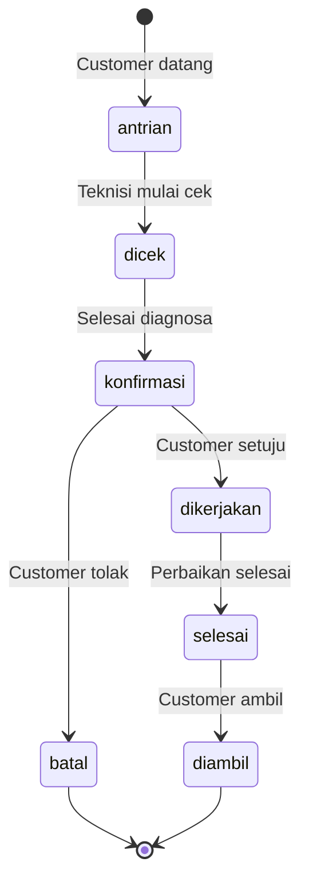

# Service Flow

## Overview

Modul Service menangani alur penerimaan, pengerjaan, dan penyelesaian servis handphone dari customer.

---

## Status Flow



---

## Status Descriptions

| Status | Description | Aksi Selanjutnya |
|--------|-------------|------------------|
| `antrian` | Baru masuk, menunggu | Assign teknisi, mulai cek |
| `dicek` | Sedang diagnosa | Input diagnosis |
| `konfirmasi` | Menunggu approval | Hubungi customer |
| `dikerjakan` | Sedang diperbaiki | Update progress |
| `selesai` | Siap diambil | Notifikasi customer |
| `diambil` | Sudah diambil | Selesai |
| `batal` | Dibatalkan | Selesai |

---

## Alur Lengkap

### 1. Penerimaan (Antrian)
```
Customer datang
    ↓
Input data customer (nama, telepon, alamat)
    ↓
Input data device (brand, model, IMEI, kelengkapan)
    ↓
Input keluhan
    ↓
Generate nomor servis (SRV-YYYY-XXX)
    ↓
Assign teknisi
    ↓
Status: ANTRIAN
```

### 2. Pengecekan (Dicek)
```
Teknisi mengambil job
    ↓
Status: DICEK
    ↓
Diagnosa masalah
    ↓
Input hasil diagnosa
    ↓
Input estimasi biaya
    ↓
Status: KONFIRMASI
```

### 3. Konfirmasi ke Customer
```
Status: KONFIRMASI
    ↓
Hubungi customer (WhatsApp/Telepon)
    ↓
Jelaskan diagnosa & biaya
    ↓
┌─────────────────┐
│ Customer setuju?│
└────────┬────────┘
         │
    ┌────┴────┐
    ▼         ▼
  Setuju    Tolak
    │         │
    ▼         ▼
DIKERJAKAN  BATAL
```

### 4. Pengerjaan (Dikerjakan)
```
Status: DIKERJAKAN
    ↓
Ambil sparepart dari inventori
    ↓
Kerjakan perbaikan
    ↓
Update catatan progress
    ↓
Perbaikan selesai
    ↓
Input biaya aktual
    ↓
Status: SELESAI
```

### 5. Pengambilan (Selesai → Diambil)
```
Status: SELESAI
    ↓
Notifikasi customer
    ↓
Customer datang
    ↓
Verifikasi device
    ↓
Pembayaran
    ↓
Status: DIAMBIL
```

---

## Nomor Servis Format

Format: `SRV-YYYY-XXX`

- `SRV` - Prefix
- `YYYY` - Tahun
- `XXX` - Nomor urut

Contoh: `SRV-2026-001`, `SRV-2026-002`

---

## Data Structure

### Customer (JSON)
```json
{
  "name": "John Doe",
  "phone": "081234567890",
  "address": "Jl. Contoh No. 123"
}
```

### Device (JSON)
```json
{
  "brand": "Samsung",
  "model": "Galaxy A54",
  "imei": "123456789012345",
  "equipment": "Charger, Box, Casing"
}
```

---

## Aksi per Status

### Antrian
- ✅ Assign/reassign teknisi
- ✅ Edit data customer/device
- ✅ Update ke "Dicek"
- ✅ Batalkan

### Dicek
- ✅ Input diagnosa
- ✅ Input estimasi biaya
- ✅ Update ke "Konfirmasi"
- ✅ Batalkan

### Konfirmasi
- ✅ Update ke "Dikerjakan" (setuju)
- ✅ Update ke "Batal" (tolak)
- ✅ Hubungi via WhatsApp

### Dikerjakan
- ✅ Tambah sparepart
- ✅ Update catatan
- ✅ Input biaya aktual
- ✅ Update ke "Selesai"

### Selesai
- ✅ Update ke "Diambil"
- ✅ Print struk
- ✅ Hubungi via WhatsApp

### Diambil / Batal
- ❌ Read-only
- ✅ View history

---

## WhatsApp Integration

### Template Messages
```
Halo {customer_name},

Servis HP Anda dengan nomor {service_no} sudah selesai.
Silakan datang ke toko untuk mengambil.

Terima kasih.
```

### Link Format
```javascript
const message = encodeURIComponent(templateMessage);
const waLink = `https://wa.me/62${phone}?text=${message}`;
```

---

## Garansi

### Konfigurasi
- Durasi garansi: 7-90 hari (configurable)
- Berlaku sejak tanggal pengambilan

### Klaim Garansi
```
Customer datang dengan keluhan sama
    ↓
Verifikasi nomor servis
    ↓
Cek periode garansi
    ↓
┌───────────────────┐
│ Masih dalam masa  │
│    garansi?       │
└────────┬──────────┘
         │
    ┌────┴────┐
    ▼         ▼
   Ya       Tidak
    │         │
    ▼         ▼
 Gratis    Servis baru
```
